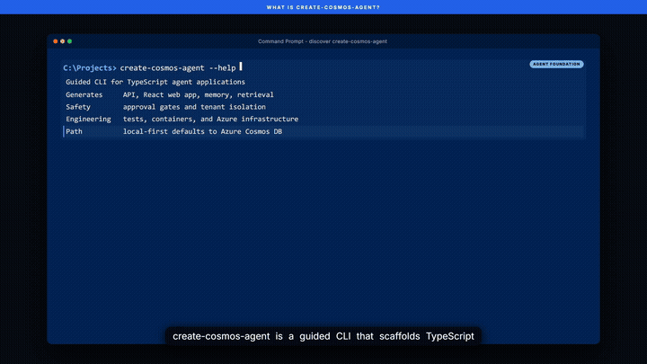

# Create Cosmos Agent

`create-cosmos-agent` is a production-oriented CLI for generating customer-facing AI applications
on Azure Cosmos DB. It creates a full TypeScript API, React workspace, secure identity boundary,
multi-provider model layer, durable memory, vector retrieval, approval workflows, telemetry, tests,
containers, and Azure infrastructure.

Start locally without Azure, Docker, a model key, or a database. Move to Microsoft Entra ID,
Azure OpenAI, and Cosmos DB without replacing the application contracts.

## Overview video

[](https://raw.githubusercontent.com/sajeetharan/cosmos-agent-starter/main/docs/media/create-cosmos-agent-overview.mp4)

[Watch the full create-cosmos-agent overview](https://raw.githubusercontent.com/sajeetharan/cosmos-agent-starter/main/docs/media/create-cosmos-agent-overview.mp4)
to see how the guided CLI turns agent architecture choices into a locally runnable application
with a production path to Azure Cosmos DB.

## Customer scenarios

| Template | Best for | Included experience |
|---|---|---|
| `chat-agent-ts` | Conversational assistants and copilots | Chat, durable memory, citations, safe actions, responsive React UI |
| `rag-agent-ts` | Enterprise knowledge and document Q&A | Document ingestion, vector retrieval, grounded answers, source citations |
| `customer-support-ts` | Service desks and customer operations | Ticket workflows, customer context, approval-gated actions |
| `multi-agent-ts` | Complex supervised workflows | Planner, specialist, reviewer, traceable handoffs, shared memory |
| `agent-memory-ts` | Lightweight foundations and custom integrations | Tenant-safe memory and approval primitives without the full customer platform |

The four customer templates use one composable platform layer, so provider, authentication,
deployment, and security behavior remain consistent.

## Quickstart

### Generate the default chat agent

```powershell
npx create-cosmos-agent my-customer-agent --yes --no-git
cd my-customer-agent
npm install
npm run dev
```

Open `http://localhost:5173`.

Local development defaults to:

- `AI_PROVIDER=mock` for deterministic responses;
- `MEMORY_BACKEND=in-memory`;
- `AUTH_MODE=local`.

No cloud credentials are needed. The mock provider and local authentication adapter are explicitly
blocked in production.

Choose another scenario:

```powershell
npx create-cosmos-agent knowledge-agent --template rag-agent-ts --yes
npx create-cosmos-agent support-agent --template customer-support-ts --yes
npx create-cosmos-agent agent-team --template multi-agent-ts --yes
```

List every template:

```powershell
npx create-cosmos-agent list
```

### Guided setup

Run the wizard when you want descriptions and numbered choices instead of remembering flags:

```powershell
create-cosmos-agent wizard my-customer-agent
```

The wizard explains and selects:

- scenario template;
- AI provider;
- development authentication;
- storage backend and Cosmos connection;
- Azure capacity;
- React application;
- Git initialization.

Press Enter to accept the recommended local defaults.

### Shell IntelliSense and tab completion

PowerShell, for the current session:

```powershell
create-cosmos-agent completion powershell | Out-String | Invoke-Expression
```

Persist it in your PowerShell profile:

```powershell
New-Item -ItemType File -Force $PROFILE | Out-Null
create-cosmos-agent completion powershell | Add-Content $PROFILE
```

Bash:

```bash
source <(create-cosmos-agent completion bash)
```

Zsh:

```zsh
source <(create-cosmos-agent completion zsh)
```

Completion dynamically suggests commands, flags, scenario templates, providers, authentication
modes, storage backends, Cosmos connection targets, and capacity models with descriptions.

## Test the generated application

```powershell
npm run typecheck
npm test
npm run build
```

Test the API while `npm run dev` is running:

```powershell
$headers = @{
  "x-tenant-id" = "tenant-demo"
  "x-user-id"   = "user-demo"
}

Invoke-RestMethod http://localhost:3000/health

Invoke-RestMethod `
  -Method Post `
  -Uri http://localhost:3000/api/chat `
  -Headers $headers `
  -ContentType "application/json" `
  -Body (@{
    message = "Help me understand my options"
    threadId = "demo-thread"
    useKnowledge = $false
  } | ConvertTo-Json)
```

## Features

### AI providers

- Azure OpenAI with `DefaultAzureCredential` or an explicit development key
- OpenAI-compatible chat completions
- Ollama for local models
- Deterministic local provider for tests and demos
- Explicit provider errors without silent fallback

### Identity and tenant isolation

- Microsoft Entra ID JWT validation in production
- Signature, issuer, audience, tenant, expiry, and user claim checks
- Local identity adapter restricted to non-production environments
- Tenant and user context derived at the API boundary, never from agent tool arguments

### Durable agent data

- Hierarchical partition key: `/tenantId`, `/userId`, `/threadId`
- User memories with provenance, confidence, model version, and deletion
- Parameterized, bounded vector queries
- Document chunks with grounded citations
- Support tickets and agent workflow state
- RU and latency telemetry without prompt-body logging

### Safe automation

- Pending, approved, rejected, executing, completed, failed, and expired action states
- Only the affected user can approve
- Agents cannot self-approve
- Idempotency keys
- ETag optimistic concurrency
- Execution blocked without recorded approval evidence

### Customer interface

- React and Vite
- Chat with citation disclosure
- Knowledge ingestion
- Support workspace
- Multi-agent run traces
- Runtime diagnostics
- Responsive layout, keyboard navigation, visible focus, semantic controls, and reduced-motion support

### Azure delivery

- Azure Developer CLI
- Bicep
- Azure Container Apps
- User-assigned Managed Identity
- Azure Cosmos DB for NoSQL
- Application Insights
- Docker and local Cosmos DB emulator

## Provider configuration

Copy `.env.example` to `.env`, then choose one provider:

```dotenv
# Azure OpenAI
AI_PROVIDER=azure-openai
AZURE_OPENAI_ENDPOINT=https://<resource>.openai.azure.com
AZURE_OPENAI_CHAT_DEPLOYMENT=<deployment>

# OpenAI
AI_PROVIDER=openai
OPENAI_API_KEY=<key>
OPENAI_MODEL=gpt-4.1-mini

# Ollama
AI_PROVIDER=ollama
OLLAMA_BASE_URL=http://localhost:11434
OLLAMA_MODEL=llama3.2
```

Do not commit `.env` or provider credentials.

## Microsoft Entra ID

Local development uses trusted development headers. Production defaults to Entra ID:

```dotenv
AUTH_MODE=entra
AUTH_ENTRA_TENANT_ID=<directory-tenant-id>
AUTH_ENTRA_AUDIENCE=<API-application-ID-or-URI>
AUTH_ENTRA_CLIENT_ID=<SPA-application-client-id>
AUTH_ENTRA_SCOPE=<exposed-API-scope>
```

The React application retrieves this non-secret configuration from `/api/config`, signs users in
with MSAL, and sends access tokens to the API.

## Cosmos DB

Start with in-memory storage. To use the local emulator:

```powershell
docker compose up -d
```

Then configure `.env`:

```dotenv
MEMORY_BACKEND=cosmos
COSMOS_ENDPOINT=https://localhost:8081
COSMOS_DATABASE=cosmos-agent
COSMOS_EMULATOR=true
COSMOS_EMULATOR_KEY=<emulator-key>
```

Azure uses `DefaultAzureCredential` and Cosmos DB data-plane RBAC instead of a production account
key.

## Deploy to Azure

```powershell
azd auth login
azd env set ENTRA_TENANT_ID "<tenant-id>"
azd env set ENTRA_AUDIENCE "<api-audience>"
azd env set ENTRA_CLIENT_ID "<spa-client-id>"
azd env set ENTRA_SCOPE "<api-scope>"
azd env set AI_PROVIDER "azure-openai"
azd env set AZURE_OPENAI_ENDPOINT "<endpoint>"
azd env set AZURE_OPENAI_CHAT_DEPLOYMENT "<deployment>"
azd up
```

Azure deployment can create billable resources. Grant the generated runtime identity the minimum
required role on the selected Azure OpenAI resource.

## CLI reference

```text
create-cosmos-agent [create] <destination> [options]
create-cosmos-agent list [--json]
create-cosmos-agent doctor [project] [--json]
create-cosmos-agent validate [project] [--json]
create-cosmos-agent completion <powershell|bash|zsh>
```

### Commands

| Command | Purpose |
|---|---|
| `create [destination]` | Create a project; this is the default command |
| `wizard [destination]` | Create using descriptive numbered choices |
| `list` | List scenario templates |
| `doctor [project]` | Inspect security and configuration patterns |
| `validate [project]` | Run generated-file, type, build, test, and Bicep checks |
| `completion <shell>` | Print dynamic PowerShell, Bash, or Zsh completion setup |

### Create options

| Option | Description | Default |
|---|---|---|
| `-t, --template <id>` | Scenario template | `chat-agent-ts` |
| `--provider <provider>` | `mock`, `azure-openai`, `openai`, or `ollama` | `mock` |
| `--auth <mode>` | `local` or `entra` | `local` |
| `--storage <backend>` | `in-memory` or `cosmos` | `in-memory` |
| `--local <mode>` | `emulator` or `azure` | `emulator` |
| `--capacity <model>` | `serverless` or `autoscale` | `serverless` |
| `--web`, `--no-web` | Include or exclude the React application | Included |
| `--git`, `--no-git` | Initialize or skip Git | Initialize |
| `-y, --yes` | Accept prompt defaults; never permits overwriting | Off |
| `-f, --force` | Allow overlays into a non-empty destination | Off |
| `--dry-run` | Print the resolved plan without writing | Off |

### General options

| Option | Description |
|---|---|
| `-C, --project <path>` | Project targeted by `doctor` or `validate` |
| `--json` | Machine-readable output |
| `-h, --help` | Help |
| `-v, --version` | Version |

Examples:

```powershell
create-cosmos-agent wizard my-agent
create-cosmos-agent my-agent --provider azure-openai --auth entra --storage cosmos --yes
npx create-cosmos-agent my-agent --dry-run --json
npx create-cosmos-agent doctor .\my-agent
npx create-cosmos-agent validate -C .\my-agent --json
```

`--force` and `--dry-run` cannot be combined. JSON creation requires a destination and either
`--yes` or `--dry-run`.

## Corporate npm proxy fallback

If a corporate npm proxy has not mirrored the current release, download the matching `.tgz` asset
from the GitHub release and pass the local file to `npx`:

```powershell
$version = "0.3.0"
$package = Join-Path $env:TEMP "create-cosmos-agent-$version.tgz"

Invoke-WebRequest `
  -Uri "https://github.com/sajeetharan/cosmos-agent-starter/releases/download/v$version/create-cosmos-agent-$version.tgz" `
  -OutFile $package

npx --yes --package $package create-cosmos-agent my-agent --yes
```

## Develop the generator

```powershell
npm install
npm run validate
npm run dev -- --list
npm run dev -- my-agent --template rag-agent-ts --yes
```

The generator composes:

1. the TypeScript base in `src/bases/typescript/template`;
2. ordered overlays in `src/features/*/template`;
3. declarative scenarios in `src/scenarios/*.json`.

This keeps provider, identity, persistence, UI, and infrastructure behavior reusable across
customer templates.

## License

MIT
