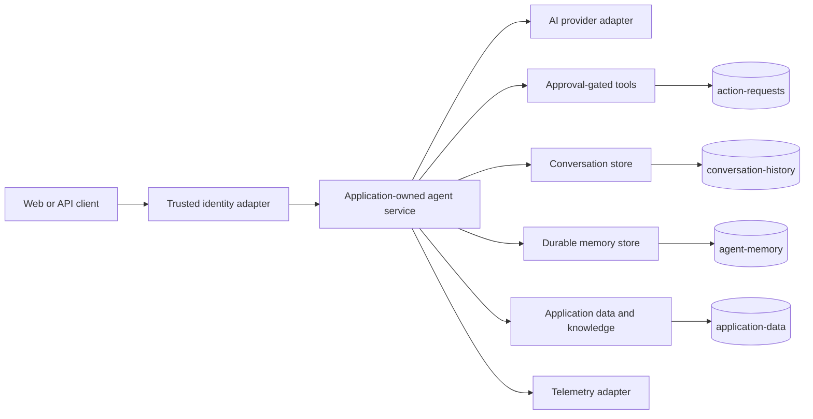

# Generated architecture

This project keeps application contracts independent from cloud SDKs while providing an opinionated
Azure production path.

## Extension points

| Component | Customize here | Preserve these invariants |
|---|---|---|
| Identity | Replace local headers with verified Entra claims or another trusted identity adapter. | Derive tenant and user scope outside model/tool input. |
| Model | Implement the AI provider contract for another hosted or local model. | Keep provider secrets server-side and keep mock providers out of production. |
| Embeddings | Replace `DeterministicEmbeddingProvider` with the approved deployment. | Record the embedding version and keep vector dimensions aligned with infrastructure. |
| Storage | Implement `ConversationStore` and `AgentMemoryStore` for another persistence system. | Enforce tenant/user scope, bounded reads, lifecycle metadata, and deletion behavior. |
| Tools | Add tools behind the application-owned agent boundary. | Require persisted approval evidence and idempotency for consequential actions. |
| Telemetry | Export the existing measurements to the organization standard. | Redact prompts, credentials, document bodies, and tenant data. |
| Hosting | Replace Container Apps/Bicep with the approved platform. | Use managed identity, least privilege, health checks, and explicit configuration. |

## Data boundaries

- `conversation-history` contains transient user/assistant messages and expires after 30 days by default.
- `agent-memory` contains curated durable memories with provenance, retention class, embedding version,
  validation time, and per-item TTL. It does not receive raw chat messages automatically.
- `application-data` contains scenario-owned durable records such as knowledge chunks and support tickets.
- `action-requests` contains approval and execution evidence and does not expire by default.

Cosmos DB is the generated production adapter, not an application contract. Replacing it should not
change the API, agent, approval, or identity contracts.

## Customization checklist

1. Validate partition keys, retention, indexing, and throughput against real access patterns.
2. Replace development identity and deterministic model/embedding adapters before production.
3. Keep retrieval traces and deletion tests when changing the memory implementation.
4. Run `npm run test:scenario`, `npm run test:security`, and `npm run typecheck`.
